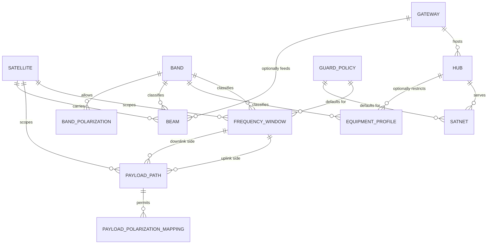
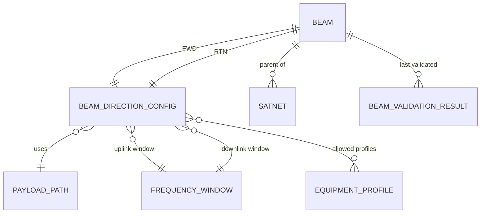
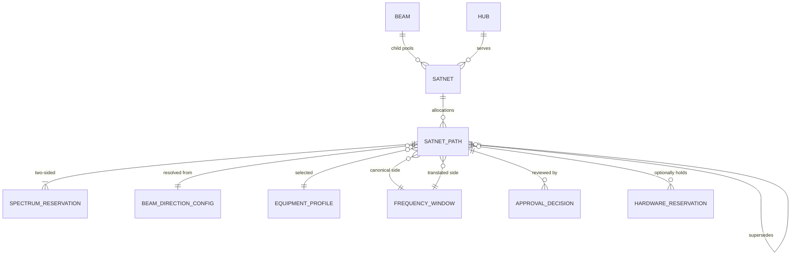
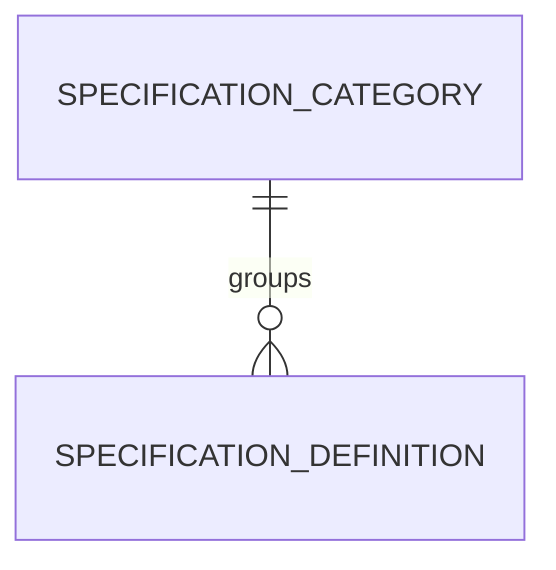
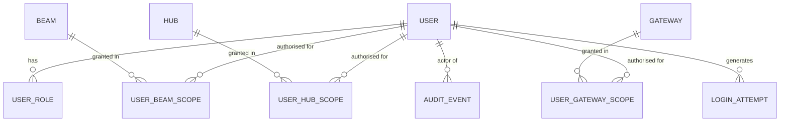

# 02 — Entity Relationship Design

**Derived from:** Root Specification §5, §6, §7, §13, §15, §16, §17, §18.
Field lists below are the *modelling-significant* fields. The full column list for each entity is the
specification's own minimum list plus these; the tables here document what the specification does not
already fix.

---

## 1. Shared mixins

Five behaviours recur; they are abstract base classes, not repeated columns.

| Mixin | Columns | Applied to |
|---|---|---|
| `UuidPk` | `id uuid PK default gen_random_uuid()` | everything (§13) |
| `Timestamped` | `created_at`, `created_by`, `updated_at`, `updated_by` | everything |
| `RecordVersioned` | `record_version integer not null default 1` | every editable record (§15.5) |
| `EffectiveDated` | `effective_from timestamptz not null`, `effective_until timestamptz null` | Satellite, EquipmentProfile, FrequencyWindow, PayloadPath, Beam, Satnet |
| `MasterDataVersioned` | `version_group uuid`, `version_number integer`, `supersedes_id FK self` | FrequencyWindow, PayloadPath, EquipmentProfile (**A-16**) |

`effective_until` NULL means open-ended. All periods are half-open `[from, until)` (**A-10**).

---

## 2. Inventory — independent and dependent master data

§3 of the specification splits Inventory into two navigation groups. The split is a *dependency*
property, so it is derived and rendered, not stored as a flag.



### 2.1 Independent data

| Entity | Key modelling notes |
|---|---|
| **Satellite** | `orbit_type ∈ {GEO, MEO, LEO}`. Owns Frequency Windows and Payload Paths, so it is the natural code-uniqueness scope for both (**A-18**). |
| **Band** | `rf_min_hz`, `rf_max_hz` are **informative** (§13.2) — allocation permission comes only from Frequency Windows. Adds `tuning_raster_hz` (nullable, **OQ-31**). Allowed polarizations are a child table `BAND_POLARIZATION(band, polarization)` rather than an array, so they are FK-referencable and admin-editable. |
| **Gateway** | Teleport site. `latitude`/`longitude` `NUMERIC(9,6)`, `time_zone` an IANA name. |
| **Hub** | `gateway_id` **not null** — §13.4 fixes `Gateway 1 ── N Hubs`. Gateway and Hub stay separate entities (§3.1): a Gateway is a *physical site*, a Hub is a *baseband platform instance* at that site. A Gateway may host hubs of different vendors; a Hub cannot span Gateways. |
| **EquipmentProfile** | See §2.3 below. |
| **GuardPolicy** | Not in the specification's entity list but required by "default guard policy" appearing on both Frequency Window (§13.6) and Satnet (§13.9). See §2.4. |

### 2.2 Dependent data

| Entity | Depends on | Key modelling notes |
|---|---|---|
| **FrequencyWindow** | Satellite, Band, GuardPolicy | `side ∈ {HUB_UPLINK, REMOTE_DOWNLINK, REMOTE_UPLINK, HUB_DOWNLINK}` = the spectrum leg (**A-02**). Exactly one `polarization` (**A-04**). `rf_start_hz`/`rf_end_hz` as `bigint` (**A-08**), plus a generated `rf_range int8range` for indexing. `min_edge_guard_hz`. Master-data versioned. |
| **PayloadPath** | Satellite, 2 × FrequencyWindow | `direction ∈ {FWD, RTN}`; `uplink_window` and `downlink_window` must have sides matching the direction (**A-03**), enforced by a check + validation. `translation_method`, `translation_constant_hz`, `spectral_inversion boolean`. Master-data versioned. |
| **PayloadPolarizationMapping** | PayloadPath | `(payload_path, uplink_polarization, downlink_polarization)`, unique together. Values are **OQ-03**; the table ships empty. |
| **Beam** | Satellite, Band, Gateway?, Hub?, 2 × BeamDirectionConfig | See §3. |

### 2.3 EquipmentProfile — conversion algebra

`type ∈ {BUC, BDC, LNB, OTHER}`. Carries `rf_min_hz`, `rf_max_hz`, `if_min_hz`, `if_max_hz`,
`lo_hz`, `conversion_method`, `sideband`, `spectral_inversion`, `priority`, optional Gateway/Hub
applicability, effective dates, master-data version.

The specification (§13.5) requires these behaviours. Note that `IF = |RF − LO|` is not invertible on
its own, which is exactly why `sideband` exists as a separate field:

| `conversion_method` | Up-conversion (IF→RF) | Down-conversion (RF→IF) | Inverting? |
|---|---|---|---|
| `LO_PLUS_IF` (`sideband = LOW_SIDE`, LO < RF) | `RF = LO + IF` | `IF = RF − LO` | no |
| `LO_MINUS_IF` (`sideband = HIGH_SIDE`, LO > RF) | `RF = LO − IF` | `IF = LO − RF` | **yes** |
| `FIXED_OFFSET` | `RF = IF + offset` | `IF = RF − offset` | no |

`LOW` / `MID` / `HIGH` remain free-text profile *labels* and drive no branching logic (§13.5).
Profile selection is by RF/IF containment and `priority`, never by parsing the label.

An inverting profile maps a half-open IF interval to a half-open RF interval by **A-10**.

### 2.4 GuardPolicy and the guard hierarchy

Guards are not a single number; §9.2 lets the operator "select or accept" a policy and §13.6/§13.9
both carry a default. Modelled as a named, admin-managed policy:

```text
GuardPolicy
  code, name
  mode ∈ {FIXED, PERCENT_OF_OCCUPIED, MAX_OF_FIXED_AND_PERCENT}
  fixed_left_hz, fixed_right_hz        # nullable
  percent_left, percent_right          # NUMERIC, nullable
  is_active
```

Resolution order when a Satnet Path is calculated (ADR-0016):

```text
1. explicit per-path override (left/right Hz, entered by an authorised user)
2. Satnet.default_guard_policy
3. FrequencyWindow.default_guard_policy         (of the canonical-side window)
4. system default guard policy setting
```

The resolved policy **and** the resolved Hz values are both stored on the Satnet Path, so a later
policy edit cannot retroactively change an existing allocation. No guard *values* are seeded —
**OQ-07**.

---

## 3. Beam — the root spectrum pool

§5 makes the Beam the root pool with exactly two direction chains. Two shapes were considered:

- **(a)** flatten both chains onto `Beam` as ~20 `fwd_*` / `rtn_*` columns;
- **(b)** a `BeamDirectionConfig` child row per direction.

**(b) is chosen.** The two chains are structurally identical (window → payload path → window →
equipment → polarization mapping), a direction can be explicitly disabled (§5.4), and validation
state is per-direction ("a Beam cannot be activated while its mandatory FWD/RTN configuration is
invalid"). Flattening would duplicate every validation rule and every uniqueness rule twice.



**Beam** — identity per §5.1, plus `is_active`, `activated_at`, `activated_by`,
`configuration_state ∈ {INCOMPLETE, INVALID, VALID}` (cached result of the last validation run).

**BeamDirectionConfig** — one row per `(beam, direction)`, unique together:

| Field | Note |
|---|---|
| `direction` | `FWD` \| `RTN` |
| `is_enabled` | explicit disable is a deliberate business case and shown in the UI (§5.4) |
| `payload_path_id` | pinned to a specific master-data version (**A-16**) |
| `uplink_window_id`, `downlink_window_id` | must equal the payload path's windows (**A-06**, **OQ-27**) |
| `canonical_leg` | which leg the operator enters the centre on (**A-07**, **OQ-28**) |
| `uplink_polarization`, `downlink_polarization` | must exist in `PAYLOAD_POLARIZATION_MAPPING` |
| `spectral_inversion_override` | nullable; NULL = inherit from payload path |

**BeamDirectionEquipmentProfile** — M:N join carrying `priority`. §5.2/§5.3 say "profile **or**
profile set", so a set is modelled and a single profile is the degenerate case. This is the candidate
pool from which the Satnet Path picks one (**A-05**); the wizard only asks the operator when more than
one candidate remains valid (§9.2).

**BeamValidationResult** — append-only record of each Beam Builder validation run: timestamp, actor,
outcome, and the list of blocking/warning rule results. It is what the Beam detail page's
"Configuration validation state" (§10.1) reads, and it gives the audit trail for activation (§18).

---

## 4. Satnet and Satnet Path



### 4.1 Satnet

Fields per §13.9. Modelling notes:

- `beam_id` not null — exactly one Beam, never re-parented. Changing Beam means a new Satnet.
- `hub_id` not null; `gateway_id` **derived** from `hub.gateway` and stored denormalised for scope
  checks and filtering, with a check that it matches.
- Capacity summary (§6) is **computed**, never stored: allocated FWD/RTN bandwidth, active path
  count, next start/end event, gaps, utilisation all come from `spectrum.selectors`. Storing them
  would create a second source of truth for free capacity, which §16 forbids.

### 4.2 SatnetPath

The single operator-facing allocation record. Field groups:

| Group | Fields |
|---|---|
| Identity | `id`, `code`, `satnet_id`, `beam_id` (denormalised, checked against `satnet.beam_id`), `direction` |
| Lifecycle | `status`, `valid_from`, `valid_until`, `change_reason`, `record_version` |
| Revision | `revision_group uuid`, `revision_number`, `supersedes_id`, `superseded_by_id` |
| User input | `input_mode ∈ {OCCUPIED_BW, SYMBOL_RATE}`, `input_value`, `rolloff NUMERIC`, `guard_policy_id`, `guard_left_hz`, `guard_right_hz` |
| Derived bandwidth | `symbol_rate_sps`, `occupied_bw_hz`, `allocated_bw_hz` |
| Canonical side | `canonical_leg`, `canonical_window_id`, `canonical_center_hz`, `canonical_occupied_range int8range`, `canonical_allocated_range int8range`, `canonical_polarization` |
| Translated side | `translated_leg`, `translated_window_id`, `translated_center_hz`, `translated_occupied_range`, `translated_allocated_range`, `translated_polarization` |
| Equipment / IF | `equipment_profile_id`, `lo_hz`, `if_start_hz`, `if_center_hz`, `if_end_hz` (nullable — "where applicable") |
| Hardware | `gw_id`, `decimator` — validated free text until **OQ-09** / **OQ-10** promote them to `HardwareResource` |
| Audit | `created_*`, `updated_*` |

Two decisions worth stating explicitly:

1. **Both sides are stored, not derived on read.** The translated side is a function of the canonical
   side and the payload path, but the payload path is master-data-versioned and can be superseded.
   Recomputing on read would silently rewrite history. Stored values are recomputed only by an
   explicit service call, which produces an Audit Event.
2. **Every derived field is system-owned.** `SatnetPathForm` never binds them; the service writes them
   from the `calculations` result. Acceptance criterion §26.16 is enforced by the form field list and
   asserted by a test that POSTs derived fields directly and expects them to be ignored.

### 4.3 Revisions (§15.4)

An `ON_AIR` record is never overwritten. `revise()` in one transaction:

```text
old.valid_until := change_effective_at        (closes the period)
old.status      := RETIRED
new := copy(old) with revision_number+1, supersedes=old, status=PLANNED|PENDING_APPROVAL
new.valid_from  := change_effective_at
old.superseded_by := new
```

Order matters: the old period must close *before* the new reservation is inserted, because the
exclusion constraint is `IMMEDIATE` (**A-14**). `revision_group` stays constant across the chain so
the history view is a single indexed query.

---

## 5. SpectrumReservation — the enforcement table

Generated by the Satnet Path service; never user-editable (§13.11).

```text
SpectrumReservation
  id                uuid PK
  kind              enum {SATNET_PATH, FIXED_RESERVE}          (A-13)
  satnet_path_id    FK -> satnet_path, NULL only when kind = FIXED_RESERVE
  beam_id           FK -> beam            NOT NULL
  frequency_window_id FK -> frequency_window NOT NULL
  leg               enum SpectrumLeg      NOT NULL
  direction         enum {FWD, RTN}       NULL for FIXED_RESERVE
  polarization      enum PolarizationType NOT NULL
  occupied_rf       int8range             NOT NULL
  allocated_rf      int8range             NOT NULL
  active_period     tstzrange             NOT NULL
  status            enum SatnetPathStatus NULL for FIXED_RESERVE
  reserves_spectrum boolean               NOT NULL              (A-12)
  reason            text                  for FIXED_RESERVE
```

Exactly **two** rows per Satnet Path — one per leg (§8.2) — written in the same transaction as the
path itself (§15.6). `beam_id`, `leg` and `polarization` are denormalised from the path and window
purely so the exclusion constraint key can be built; checks keep them consistent.

Why a single table rather than one per leg or a separate table for fixed reserves: a PostgreSQL
exclusion constraint cannot span tables, and both fixed reserves and path allocations must be mutually
exclusive (**A-13**).

---

## 6. Specification Dictionary



`SpecificationDefinition` carries the §2 field list. Modelling notes:

- `code` is `citext`-unique and **read-only in the admin UI** once the code appears in the code-side
  registry `specifications/registry.py` (**A-20**). A `is_system_managed` boolean marks those rows.
- `direction_applicability ∈ {FWD, RTN, BOTH, NA}`.
- `display_precision` is a small integer used by the `` template tag; templates never
  hard-code precision.
- The info-popover is one inclusion tag + one partial, used everywhere a code is rendered (§2, §26.3).
  A test asserts no template contains a hard-coded specification description.

Categories are a table rather than a choices enum because §2 lists Category as an admin-managed
attribute alongside display order.

---

## 7. Accounts, scope and audit



Three explicit scope tables rather than one generic `(scope_type, object_id)` table: explicit foreign
keys give referential integrity, allow `ON DELETE` protection, and let the scoped querysets
(`Beam.objects.for_user(u)`) be plain joins instead of runtime type dispatch.

`AuditEvent` is append-only (**A-15**) and stores actor, timestamp, action, object type + UUID,
`before` / `after` JSONB, change reason, request ID, source IP, user agent, import batch and
success/failure (§18). `before`/`after` are stored as JSONB so the field-level diff view is a query,
not a re-parse.

---

## 8. Approvals, imports, hardware, reporting

| Entity | Notes |
|---|---|
| **ApprovalDecision** | `satnet_path_id`, `decision ∈ {APPROVED, REJECTED}`, `decided_by`, `decided_at`, `comment`, `from_status`, `to_status`. Append-only. `REQUIRE_SEPARATE_APPROVER` (**OQ-11**) is checked against `satnet_path.created_by`. |
| **ImportBatch** | `file_name`, `file_sha256`, `stage ∈ {DRY_RUN, COMMITTED, FAILED}`, `uploaded_by`, counts per classification, `batch_policy`. Commit verifies the hash matches the dry-run (§17.1). |
| **ImportRow** | `batch_id`, `sheet`, `row_number`, `raw JSONB`, `normalized JSONB`, `classification ∈ {VALID, WARNING, ERROR, DUPLICATE, CONFLICT, NEEDS_MAPPING, IGNORED_FREE_CAPACITY}`, `messages JSONB`, `resulting_object_id`. |
| **ImportMapping** | Remembered inventory reference mappings (spreadsheet label → UUID) so repeat imports do not re-ask. |
| **HardwareResource / HardwareReservation** | Shipped, unpopulated. `HardwareReservation` gets its own exclusion constraint on `(resource_id, active_period)` when `resource.is_exclusive`. Gated on **OQ-09**/**OQ-10**. |
| **SavedView** | `user`, `name`, `page`, `filters JSONB`, `columns JSONB`, `is_shared` (§10.3). |
| **SystemSetting** | Typed key/value with audit: suspended-reservation policy, separate-approver requirement, default input mode, display time zone. Every read goes through `operations.settings.get()`; no direct DB reads. |

---

## 9. Enumerations

Enumerations are Python `TextChoices` mirrored by PostgreSQL CHECK constraints (not native enum types
— altering a native enum inside a transaction is restricted, and CHECK gives clearer error text).

```text
Direction        FWD | RTN
SpectrumLeg      HUB_UPLINK | REMOTE_DOWNLINK | REMOTE_UPLINK | HUB_DOWNLINK
PolarizationType RHCP | LHCP | H | V                      # which are in use: OQ-14
OrbitType        GEO | MEO | LEO
EquipmentType    BUC | BDC | LNB | OTHER
ConversionMethod LO_PLUS_IF | LO_MINUS_IF | FIXED_OFFSET
Sideband         LOW_SIDE | HIGH_SIDE
TranslationMethod OFFSET_ADD | OFFSET_SUBTRACT | LO_REFLECT   # values per path: OQ-02
SatnetPathStatus DRAFT | PLANNED | PENDING_APPROVAL | ON_AIR | SUSPENDED | RETIRED | CANCELLED | IMPORT_REVIEW
GuardMode        FIXED | PERCENT_OF_OCCUPIED | MAX_OF_FIXED_AND_PERCENT
InputMode        OCCUPIED_BW | SYMBOL_RATE
ReservationKind  SATNET_PATH | FIXED_RESERVE
```

`TranslationMethod.LO_REFLECT` is the inverting case `f(x) = translation_constant − x`. Which method
and which constant applies to any real payload is **OQ-02** and is not seeded.

---

## 10. Entities deliberately absent

| Not created | Reason |
|---|---|
| `InterferenceDomain`, or any configurable reuse-domain object | §4 forbids it, including a renamed replacement. Reuse scope is derived from Beam + Window + leg + polarization + time (**A-01**). |
| `Carrier` | §7 — `SatnetPath` is the only term, in the model, the API, the URLs and the UI. |
| `FreeCapacity` / `Gap` table | §16 — free capacity is computed. Persisting it would create a second, staleable source of truth. |
| `Channel`, `Transponder` | Not in the specification; a Payload Path already carries the translation. Introducing them would require RF values that are unconfirmed. |
| Denormalised utilisation counters | Same reason as free capacity; the dashboard queries the reservation table. |
